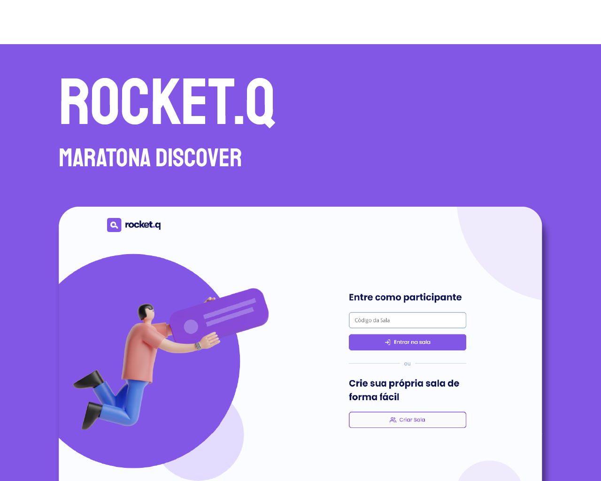
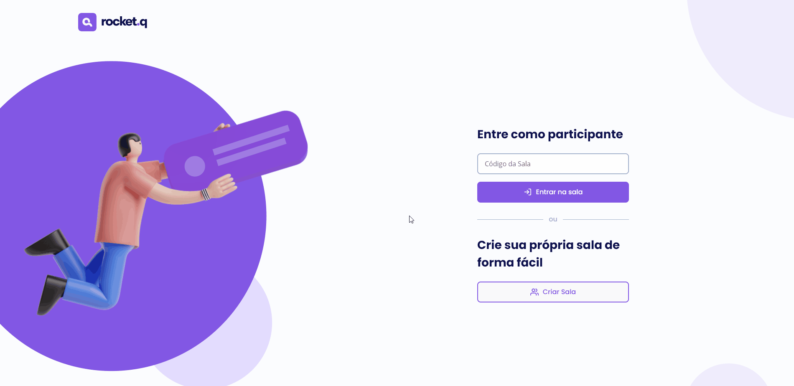
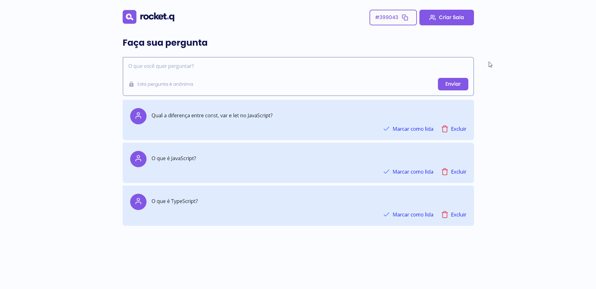
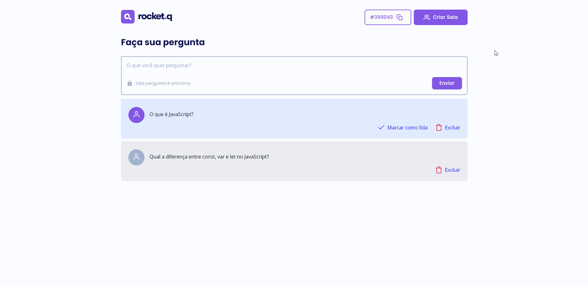
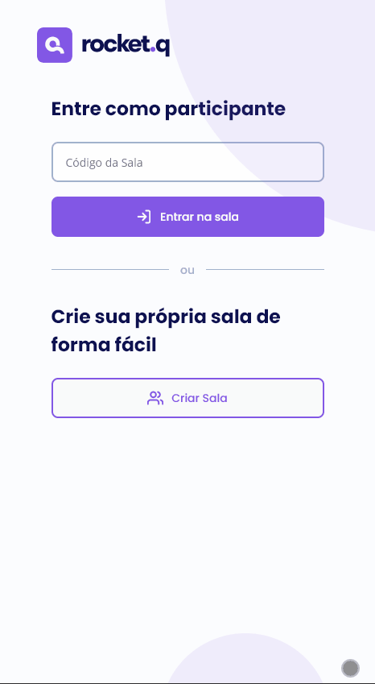

# Rocket.q

<p align="center">
    
</p>

## 💻 Projeto

### Este projeto foi desenvolvido durante a Next Level Week #05 😀
<br>

O Rocket.q, é uma Aplicação Web, para internautas anônimos fazerem perguntas, onde o criador da sala com seu código, possa gerenciar as perguntas e com posse da senha possa marcar como lidas. Para este objetivo utilizamos algumas tecnologias como EJS, Node.js e outras ferramentas de Desenvolvimento. 

Durante a semana em que avançamos novos conceitos e formas de chegar aos resultados foram apresentados, e tudo foi passando com muita prática e mão na massa.
<br>
<br>

## Aplicação - Versão Web

<p align="center">
    
</p>
<p align="center">
Criando sala e perguntas
</p>

<br>

<p align="center">
    
</p>
<p align="center">
Marcar pergunta como lida / excluir pergunta
</p>

<br>

<p align="center">
    
</p>
<p align="center">
Copiar código da sala criada e entrando na sala
</p>

<br>

## Aplicação - Mobile

<p align="center">
    
</p>
<p align="center">
Criando salas e perguntas
</p>

<br>
<br>

## 🔨 Tecnologias e Ferramentas Utilizadas
 - Node.js
 - EJS
 - SQLite
 - Nodemon
 - VSCode

## Execute o projeto

### Requisitos
 - Instale o [Node.js](https://nodejs.org/en/download/)
 - De preferência, instale o editor [VSCode](https://code.visualstudio.com/)

### Realize um clone do projeto

```bash
$ git clone git@github.com:300Marco/rocket.q.git
```

### Próximos passos

```bash
# Instalação das dependências
$ npm install

# Execute o projeto
$ npm start
```

## 📃 Licença

Esse projeto está sob a licença MIT. Veja o arquivo [LICENSE](.github/LICENSE.md) para mais detalhes.